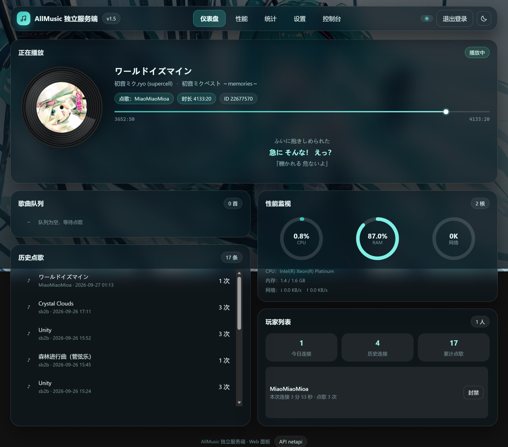

*本项目由AI生成
# AllmusicStandaloneServer


AllMusic 独立音乐服务器（Standalone Server）：实现 [AllMusic](https://github.com/Coloryr/AllMusic) 服务端插件的全部功能，可脱离 Minecraft 独立运行，作为第三方音乐服务端供 [AllMusicConnect](https://github.com/emmWow9664/AllmusicConnect) 客户端模组连接。

## 功能

- 完整的 AllMusic 服务端功能：点歌、切歌、搜索、歌单、投票、静音、封禁、HUD 控制等
- 桌面控制台窗口：日志实时显示 + 指令输入框；关闭窗口后驻留系统托盘，服务继续在后台运行
- 内嵌 Web 面板：浏览器查看播放 / 队列 / 玩家（含今日连接人数）/ 统计 / 性能，管理员可登录管理
- 无图形环境时以控制台模式运行
- 音乐 API 热加载（`netapi` jar，如 `netapi-1.0.1-SNAPSHOT.jar`）
- 歌曲与歌词保存、点赞置顶（TopLyric）、经济 / 点歌花费扩展接口

## 运行要求

- **Java 25+**（推荐）
- 服务端本体兼容 Java 21，但常用的 `netapi` 音乐 API 是 Java 25 编译的（class 版本 69），
  用 Java 21 启动会在加载 API 时报 `UnsupportedClassVersionError`，服务端随后退出（原因写入 `allmusic_server/crash.log`）
- 如果必须在 Java 21 下运行，请改用按 Java 21 编译的 API jar
- 双击启动使用的是系统对 `.jar` 的文件关联，请确保该关联指向期望的 JDK（如 `Zulu 25\bin\javaw.exe`）

## 使用

**方式一（推荐）：直接双击 jar 运行** —— 无需终端，双击 `AllmusicStandaloneServer-<版本>.jar` 即可启动**控制台窗口**（日志 + 指令输入）。
若双击无效，说明系统未把 `.jar` 关联到 Java，可用方式二，或右键 jar →「打开方式」选择 `javaw.exe`。

窗口行为：

- 关闭窗口（点右上角 ×）不会退出服务端：窗口只是隐藏，服务继续在后台运行，系统托盘常驻图标
- 托盘图标**双击**，或右键菜单 `Open Console`，可重新打开控制台窗口
- 托盘右键菜单还提供 `Open Web Panel`（用默认浏览器打开 Web 面板）与 `Exit`（退出服务端）
- 需要彻底关闭时：托盘菜单 `Exit`，或在控制台窗口/终端输入 `server stop`
- 关闭窗口后服务端仍在后台运行属于预期行为；不使用托盘时（无桌面环境）关闭窗口即退出

**方式二：命令行运行**

```bash
java -jar build/libs/AllmusicStandaloneServer-1.3.jar
```

- 服务端默认监听 `0.0.0.0:5223`，可在 `standalone_config.json` 中修改 `port` / `bindHost`
- 数据与配置文件存放于 jar 同级的 `allmusic_server/` 目录（`config.json`、`message.json`、`music.json`、`ban.json`、`cookie.json`、`hud.json` 等），与启动时的工作目录无关
- 启动失败时会弹窗提示，并写入 `allmusic_server/crash.log`
- 玩家通过 AllMusic Client + AllmusicConnect 模组执行 `/music connect <ip> [端口]` 接入（端口默认 `5223`）
- 客户端异常掉线（断网 / 断电 / 路由器回收连接）时不会一直挂在在线列表：连接启用 TCP 保活探测（空闲 20 秒起、每 5 秒一次、连续 3 次无响应即判定掉线并注销会话）

## 控制台模式（无图形环境）

没有图形环境时（Linux 服务器、SSH、`-Djava.awt.headless=true`）服务端自动进入控制台模式，
直接在终端里输入指令（回车执行）：

```text
list                                  # AllMusic 指令直接输入，以控制台身份执行（拥有管理员权限）
play 起风了                            # 点歌 / 搜索 / 封禁等全部 AllMusic 指令都可用
server help                           # 查看服务端自身指令
server status                         # 运行状态：监听端口、在线玩家、Web 面板、密码状态、数据目录
server about                          # 关于信息：版本、作者、协议、项目仓库、运行环境、运行时长
server stats [页码]                    # 统计：概览 + 玩家点歌排行（分页，每页 10 条）
server stats songs [页码]              # 统计：点歌历史（分页）
server config list [关键字]            # 列出全部配置项（可按关键字过滤）
server config get <配置项>             # 查看配置项当前值
server config set <配置项> <值>        # 修改并保存配置（端口 / 绑定地址 / Web 面板立即生效，无需重启）
server password <新密码>               # 设置 Web 管理员密码（至少 4 位，只保存 PBKDF2 哈希）
server password clear                 # 清除 Web 管理员密码
server stop                           # 关闭服务端（也可直接输入 exit / quit，或按 Ctrl+C）
```

- 配置项可用「路径」或「原名」指定，例如
  `server config set standalone.port 5223`、`server config set port 5223`、
  `server config set limit.maxPlayList 5`、`server config set maxPlayList 5`；
  可配置项与 Web 面板「设置」页完全一致（核心配置 → `allmusic_server/config.json`，独立服务端配置 → `standalone_config.json`）。
- `config set` 会就地校验：端口范围 1~65535、整数项必须是整数、布尔项支持 `true/false`（`on/off`、`1/0` 亦可）。
- 输入 `help` 会同时列出服务端指令与 AllMusic 指令。
- `server stats` 的数据与 Web 面板「统计」页一致（点歌历史最多保留 500 条）；页码越界会自动落到最后一页。
- 双击运行（`javaw`）时标准输入不可用，但同一套指令可直接在**控制台窗口**的输入框里执行（`server ...` 与 AllMusic 指令都支持）；SSH 下用 `java -jar` 启动即可。

## 音乐 API（netapi）配置

服务端通过「音乐 API」实现歌曲搜索与播放，`netapi` 是最常用的音乐 API 实现。

> 本项目**不再随 Release 分发** netapi（各版本的 Release 里已不再提供该资产），请自行从官方仓库获取：
>
> - netapi 官方仓库：<https://github.com/Coloryr/netapi>

1. 从上面仓库获取（或自行构建）`netapi-1.0.1-SNAPSHOT.jar`
2. 将 `netapi-*.jar` 放入服务端 jar 同级的 `allmusic_server/api/` 目录（首次启动会自动创建该目录）
3. **重启服务端**，日志出现「注册音乐API：\<id\>」即加载成功
4. API 首次运行后会在其 jar 同目录生成 `netapi.json`，可在此调整音质与编码：

```json
{
  "level": "exhigh",
  "encodeType": "mp3"
}
```

| 配置项 | 说明 |
| --- | --- |
| `level` | 音质档位（如 `standard` / `higher` / `exhigh` / `lossless`，具体以 netapi 文档为准）；`exhigh` + `mp3` 通常即 320k MP3 |
| `encodeType` | 音频编码格式：`mp3` / `aac` / `flac`。注意 `aac` 会返回 `.m4a`(AAC) 文件，AllMusic 客户端 **3.x**（如 3.1.6）只有 flac/ogg/mp3 解码器，会提示「不支持这样的文件播放」且无声，**建议填 `mp3`**；4.x 客户端额外支持 m4a |

- 修改 `netapi.json` 或更换 API jar 后需**重启服务端**生效
- API jar 内需包含 `version` 文件（内容为字符 `2`），否则会被判定为旧版 API 跳过加载
- 使用 `/music api <API名> [参数]` 调用 API 的扩展命令（如查看 / 设置 Cookie）

## 内嵌 Web 面板

服务端自带一个零依赖的内嵌 Web 展示与管理面板，浏览器打开即可使用。



> 图为 Web 面板「仪表盘」视图（深色主题）：正在播放与滚动歌词、歌曲队列、历史点歌、CPU / 内存 / 网络圆环、玩家列表。

- 默认地址：`http://127.0.0.1:8080/`（默认绑定 `0.0.0.0`，局域网内可用本机 IP 访问）
- 端口、绑定地址、是否启用：在 Web 面板「设置」页或控制台 `server config set standalone.webPort <端口>` 修改，**改动需重启服务端**
- 界面：单页多视图（**仪表盘 / 性能 / 统计 / 设置 / 控制台**），半透明组件 + 明暗主题切换，壁纸按屏幕裁剪
- **普通用户无需登录，只能查看**：仪表盘（黑胶唱片封面、进度条、当前/上一句/下一句滚动歌词、歌曲队列、历史点歌、CPU/内存/网络圆环、玩家列表）、性能页（CPU / 内存 / 网络折线图，CPU 可在「总使用率 / 各核心」间切换）、点歌统计（含**今日连接人数**）
- **管理员**需先在「设置」页设置管理员密码（只保存 PBKDF2 加盐哈希，不保存明文），登录后可以：
  切歌、移除队列项、封禁/解封歌曲与玩家、执行服务端指令、查看服务端日志，
  并可在设置页**直接读写全部配置项**（与控制台 `server config`、桌面控制台窗口共用一份清单，
  标注「需重启」的项要重启服务端才生效）、**设置或清除管理员密码**（两者都会作废所有登录会话）
- 只读接口：`/api/public/status`、`/api/public/queue`、`/api/public/players`、`/api/public/stats`、`/api/public/perf`、`/api/public/lyric`（歌词三行）
- 管理接口（需 `Authorization: Bearer <token>`）：`/api/me`、`/api/logout`、`/api/admin/bans`、`/api/admin/logs`、`/api/admin/config`（GET 读 / POST 写）、`/api/admin/password`、`/api/admin/next`、`/api/admin/queue/delete`、`/api/admin/music/ban|unban`、`/api/admin/player/ban|unban`、`/api/admin/command`
- 出于安全考虑，Web 面板**不允许执行 `/music stop`**（会直接关闭整个服务端）
- 同一 IP 连续输错 5 次密码将锁定 5 分钟；登录凭证 12 小时绝对过期、闲置 30 分钟失效

> ⚠️ 面板默认绑定所有网卡，相当于把管理页面暴露在网络上，安全性完全依赖密码强度。
> 请设置足够复杂的密码；公网使用建议只放行必要端口，并置于反向代理（如 nginx）之后。

## 构建

```bash
gradlew build
```

产物（ShadowJar，已重定位 httpclient 依赖以兼容官方音乐 API jar）：

- `build/libs/AllmusicStandaloneServer-1.3.jar` —— 独立服务端主程序（Main-Class: `com.example.standalone.Main`，可直接双击运行）
- `releases/AllmusicStandaloneServer-<版本>.jar` —— 各版本产物归档

> 注意：Gradle 7.6+ 会清理 `build/` 目录下的"陈旧任务输出"，历史版本 jar 放在 `build/libs` 里会被删掉；
> 构建时会自动归档一份到 `releases/`（位于 `build/` 之外，不会被清理），请以 `releases/` 作为长期保留的产物目录。

音乐 API（`netapi-*.jar`）本项目不再随 Release 分发，请从官方仓库 [Coloryr/netapi](https://github.com/Coloryr/netapi) 获取，放入 `allmusic_server/api/` 即可，详见上方「音乐 API（netapi）配置」。

## 说明

- 本项目为 [AllMusic](https://github.com/Coloryr/AllMusic) 的衍生作品，修改了其服务端核心以独立于 Minecraft 运行
- 许可证：GPL-3.0（详见 [NOTICE.md](NOTICE.md) 与 [LICENSE](LICENSE)）
